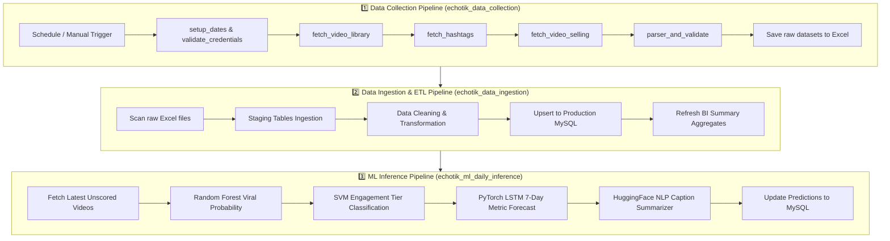

# 🚀 TikTrend BI — Airflow Data Pipeline & ML Engine

Repository ini berisi arsitektur pipeline data end-to-end berbasis **Apache Airflow 3**, **FastAPI Machine Learning Service**, dan **ETL Ingestion Engine** untuk mengumpulkan data tren TikTok dari EchoTik API, menyimpannya ke MySQL, serta menjalankan prediksi viralitas dan tren deret waktu LSTM secara otomatis.

---

## 📊 1. Alur Kerja Pipeline (End-to-End Workflow)



---

## 🔄 2. Rincian Tiga DAG Utama

| DAG Name | Jadwal / Trigger | Tanggung Jawab Utama |
| :--- | :--- | :--- |
| **`echotik_data_collection`** | Setiap 12 Jam (`0 */12 * * *`) | Menarik data live video library, hashtags trending, dan data video selling dari EchoTik API. Menghasilkan file Excel terstruktur di direktori staging. |
| **`echotik_data_ingestion`** | Otomatis setelah collection | Membaca file Excel, memvalidasi skema data, memasukkan ke tabel staging, melakukan *upsert* idempotensial ke tabel produksi (`videos_echotik`, `hashtags_echotik`, `influencers`), dan memperbarui view analitik. |
| **`echotik_ml_daily_inference`** | Harian (`0 2 * * *`) | Mengirimkan data video baru ke microservice FastAPI (`http://localhost:8001`) untuk kalkulasi probabilitas viral (Random Forest), klasifikasi tier (SVM), dan prediksi tren 7 hari (PyTorch LSTM). |

---

## 🚀 3. Alur CI/CD Deployment Otomatis (GitHub Actions)

Dengan setup GitHub Actions yang telah dikonfigurasi, Anda **tidak perlu login ke server manual** untuk meng-update logic pipeline.

```text
[Laptop Anda] 
      │  (git add . && git commit && git push origin main)
      ▼
[GitHub Repository: romakelap/tiktok-dag-pipeline]
      │  (GitHub Actions Workflow: .github/workflows/deploy.yml)
      ▼
[AWS EC2 Server: 52.77.214.191]
      │  - Git pull branch main terbaru
      │  - Sinkronisasi folder dags/ ke AIRFLOW_HOME
      ▼
[Airflow 3 Standalone Service]
      └─ Auto-reload DAGs dalam 30 detik (Zero-Downtime)
```

---

## 📁 4. Struktur Direktori Proyek

```text
tiktok-dag-pipeline/
├── .github/
│   └── workflows/
│       └── deploy.yml              # CI/CD otomatis via SSH ke EC2
├── config/
│   ├── airflow.cfg                 # Konfigurasi runtime Airflow
│   ├── categories_config.py        # Pemetaan kategori konten TikTok
│   └── db_config.py                # Konfigurasi tabel MySQL & staging
├── dags/
│   ├── echotik_data_collection.py  # DAG Pengambilan Data
│   ├── echotik_data_ingestion.py   # DAG ETL & Ingestion MySQL
│   ├── echotik_ml_daily_inference.py # DAG Inferensi Model ML
│   └── orchestrate_collection.py   # DAG Master Orchestrator
├── ml-service/
│   ├── app.py                      # FastAPI ML Microservice (Port 8001)
│   ├── artifacts/                  # Bobot model ML (.pkl, .pt, NLP vocab)
│   └── inference/                  # Skrip training & inferensi
├── plugins/
│   ├── hooks/                      # Custom Airflow Hooks (DB & EchoTik Client)
│   └── utils/                      # Validator, parser, dan transformator
├── sql/                            # Skrip DDL skema database MySQL
├── .gitignore
└── README.md
```

---

## 🛠️ 5. Cara Mengupdate Logic Pipeline

1. **Edit kode** di komputer lokal Anda (misal mengubah threshold di `config/` atau task di `dags/`).
2. **Push ke GitHub**:
   ```bash
   git add .
   git commit -m "feat: perbarui parameter ingestion"
   git push origin main
   ```
3. **Pantau status**: GitHub Actions akan otomatis melakukan deployment ke AWS EC2 dalam hitungan detik. Cek status pipeline di dashboard Airflow:
   👉 **[http://52.77.214.191:8080](http://52.77.214.191:8080)**
