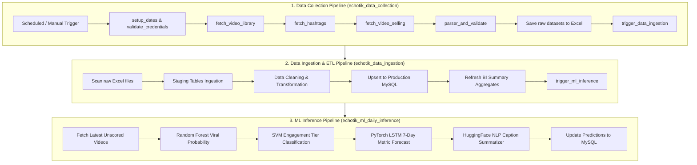

# TikTrend BI — Airflow Data Pipeline & ML Engine

An end-to-end automated data pipeline architecture built on **Apache Airflow**, **FastAPI Machine Learning Service**, and a robust **ETL Ingestion Engine**. This repository manages the scheduled collection of TikTok trend datasets from the EchoTik API, persists cleansed records into MySQL, and executes daily machine learning predictions (Virality probability, Engagement Tier classification, LSTM time-series forecasting, and NLP summarization).

---

## 1. End-to-End Pipeline Architecture



---

## 2. Core DAGs Overview

| DAG Name | Schedule / Trigger | Primary Responsibilities |
| :--- | :--- | :--- |
| **`echotik_data_collection`** | Every 12 Hours (`0 */12 * * *`) | Fetches live video library, trending hashtags, and video selling leaderboards from the EchoTik API. Generates structured datasets in staging and triggers the Ingestion DAG upon completion. |
| **`echotik_data_ingestion`** | Automated (triggered by DAG 1) | Scans datasets, validates schema consistency, loads staging tables, performs idempotent upserts into production MySQL tables (`videos_echotik`, `hashtags_echotik`, `influencers`), and updates analytical aggregates. |
| **`echotik_ml_daily_inference`** | Automated (triggered by DAG 2) | Sends newly collected videos to the FastAPI ML microservice to compute virality probabilities (Random Forest), tier classification (SVM), and 7-day metric forecasts (PyTorch LSTM). |

---

## 3. Automated Authentication & Monitoring

- **Automated Token Management:** Built-in auto-login service handles Bearer token generation, validation, and automated refresh with Airflow Variable synchronization without requiring manual browser inspection.
- **Zero-Downtime Auto-Recovery:** The API client automatically intercepts HTTP 401 errors, acquires a fresh access token, and retries the pending request seamlessly.
- **Unified Alert System:** Real-time lifecycle notifications (task execution, token status, dataset volumes, and pipeline summaries) delivered via Google Chat and Discord webhooks.

---

## 4. CI/CD & Deployment Workflow

The repository is equipped with GitHub Actions automation for continuous deployment:

```text
[Local Development] 
       │  (git push origin main)
       ▼
[GitHub Repository]
       │  (GitHub Actions Workflow: deploy.yml)
       ▼
[Production Server]
       │  - Pulls latest main branch commits
       │  - Synchronizes DAGs and plugins
       ▼
[Airflow Daemon]
       └─ Auto-reloads DAG definitions with zero downtime
```

---

## 5. Project Directory Structure

```text
tiktok-dag-pipeline/
├── .github/
│   └── workflows/
│       └── deploy.yml              # CI/CD automation workflow
├── config/
│   ├── airflow.cfg                 # Airflow runtime configuration
│   ├── categories_config.py        # TikTok content category mapping
│   └── db_config.py                # Database and staging configuration
├── dags/
│   ├── echotik_data_collection.py  # Data collection DAG
│   ├── echotik_data_ingestion.py   # ETL & database ingestion DAG
│   └── echotik_ml_daily_inference.py # Machine learning inference DAG
├── ml-service/
│   ├── app.py                      # FastAPI ML microservice
│   ├── artifacts/                  # Trained model weights (.pkl, .pt)
│   └── inference/                  # Model training and inference routines
├── plugins/
│   ├── hooks/                      # Custom Airflow hooks (DB and EchoTik client)
│   └── utils/                      # Auth service, validators, and notifiers
├── sql/                            # Database DDL schemas and migration scripts
├── .gitignore
└── README.md
```
